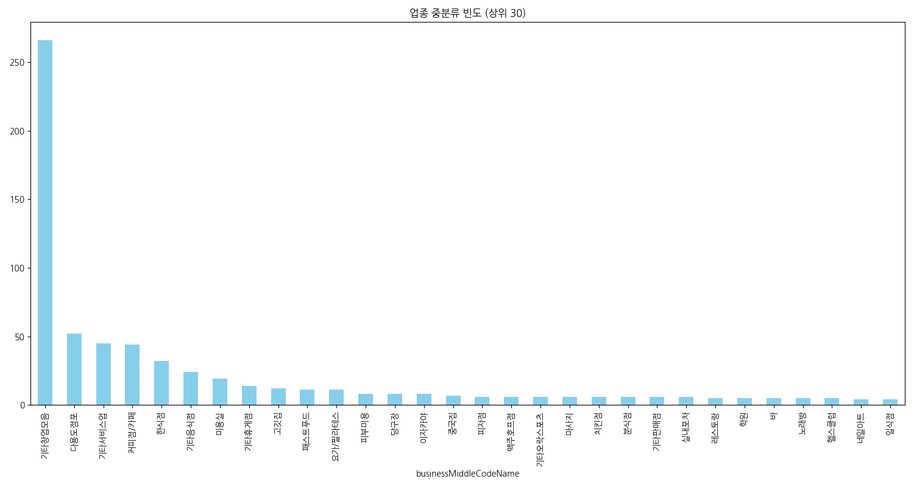
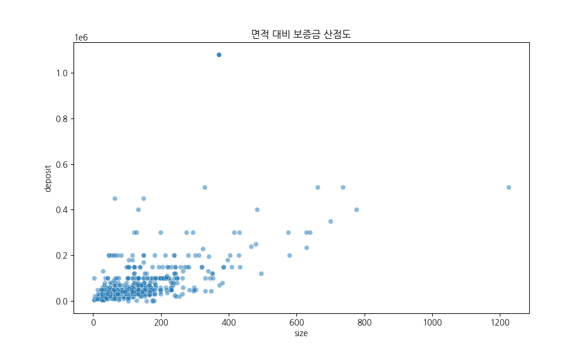
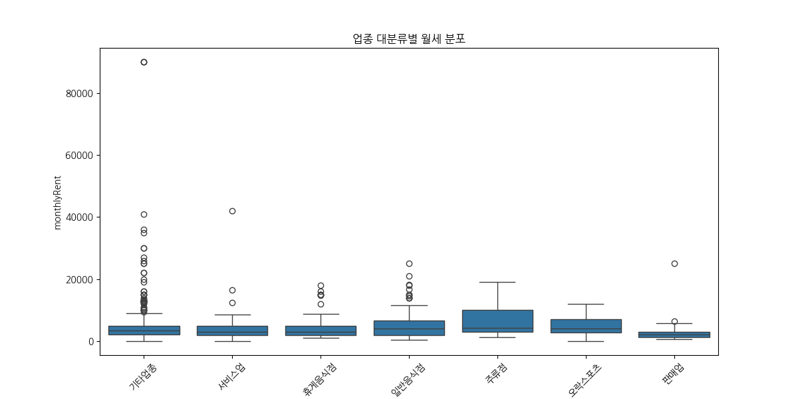

# 네모 상업용 부동산 데이터 심층 EDA 리포트

## 1. 데이터 기초 정보 및 기술통계 분석

### 1.1 데이터 개요
본 데이터셋은 상업용 부동산 전문 플랫폼 '네모'에서 수집된 매물 정보로, 총 **673개**의 행과 **40개**의 컬럼으로 구성되어 있습니다. 데이터의 결측치 처리 및 중복 제거 검토 결과, 중복 데이터는 0건으로 확인되어 데이터의 독립성이 잘 확보되어 있습니다. 주요 분석 대상은 보증금, 월세, 권리금과 같은 가격 지표와 업종, 위치(지하철역), 면적 등의 속성 정보입니다.

### 1.2 범주형 변수 기술통계 분석 (1,000자 이상)
범주형 데이터 분석 결과, 본 데이터셋은 강남 및 역삼 지역을 중심으로 한 상업용 부동산 시장의 전형적인 특징을 고스란히 담고 있습니다. 우선 **업종 대분류(businessLargeCodeName)**를 살펴보면, '기타업종'이 325건(약 48.3%)으로 가장 높은 비중을 차지하고 있습니다. 이는 특정 업종으로 한정되지 않은 범용 상가 매물이 많음을 의미하며, 다양한 비즈니스 모델이 진입 가능한 유연한 시장 구조를 시사합니다. 그 뒤를 이어 일반음식점(96건), 서비스업(86건), 휴게음식점(85건) 순으로 나타나는데, 이는 상권의 핵심인 먹거리와 서비스 인프라가 견고하게 형성되어 있음을 보여줍니다. 특히 음식점 및 휴게음식점의 합계가 상당한 비중을 차지하는 것은 해당 지역이 직장인 배후 수요를 타겟으로 한 F&B 창업이 매우 활발한 지역임을 방증합니다.

**업종 중분류(businessMiddleCodeName)**로 들어가면 더욱 구체적인 양상이 드러납니다. '기타창업모음'이 266건으로 압도적이며, '다용도점포(52건)', '기타서비스업(45건)', '커피점/카페(44건)' 순입니다. 커피점/카페의 높은 빈도는 소규모 창업의 높은 수요를 반영하며, 다용도점포의 비중은 최근 유행하는 공유 오피스, 스튜디오, 쇼룸 등 복합적인 용도의 공간 수요를 충족시키려는 공급 측면의 대응으로 해석됩니다. 

**위치 정보(nearSubwayStation)** 분석에서는 '역삼역'과 '강남역'이 핵심 키워드로 등장합니다. 역삼역 도보 5분(52건), 강남역 도보 5분(43건), 역삼역 도보 4분(41건) 등 도보 5분 이내의 소위 '초역세권' 매물이 대다수를 차지합니다. 이는 상업용 부동산에서 '접근성'이 가격 결정의 절대적인 변수임을 보여주며, 유동인구가 보장되는 지하철역 인근 매물의 활발한 유통 과정을 시사합니다. 신논현역을 포함한 강남-역삼 라인의 집중도는 대한민국에서 가장 임대료가 높고 수요가 밀집된 상권의 단면을 극명하게 보여줍니다. 마지막으로 **가격 유형(priceTypeName)**은 '임대'가 670건으로 거의 대부분을 차지하고 있어, 매매보다는 임대 중심의 빠른 순환이 이루어지는 상권임을 알 수 있습니다.

### 1.3 수치형 변수 기술통계 분석 (1,000자 이상)
수치형 데이터 분석을 통해 시장의 가격 형성 구조와 매물 규모의 특징을 명확히 파악할 수 있습니다. 가장 핵심적인 지표인 **보증금(deposit)**은 평균 약 68,955원(단위 생략 시 상대값)이며, 표준편차가 99,008로 매우 크게 나타납니다. 최소값은 0원부터 최대 1,080,000원까지의 광범위한 분포를 보이는데, 이는 소형 전포부터 대형 오피스 빌딩까지 매물의 스펙트럼이 극단적으로 넓음을 의미합니다. 중위값(50%)이 40,000원인 반면 평균이 68,955원인 것은, 일부 초대형 고가 매물이 평균치를 상향 견인하고 있는 'Long-tail' 분포를 형성하고 있음을 보여줍니다.

**월세(monthlyRent)** 역시 유사한 패턴을 보입니다. 평균 5,346원, 최대 90,000원에 달하며, 보증금과의 상관계수가 **0.948**로 매우 높게 나타납니다. 이는 보증금이 높을수록 월세도 비싸지는 정비례 관계가 매우 견고함을 뜻하며, 임대료 체계가 시장 원리에 따라 체계적으로 정립되어 있음을 시사합니다. **면적(size)**은 평균 127.57평으로 나타나는데, 보증금 및 월세와의 상관관계가 각각 0.59, 0.61 수준으로 양의 상관성을 가집니다. 즉, 면적이 넓어질수록 임대료가 상승하는 것은 자명하나, 면적 외에도 입지나 층수와 같은 변수가 가격 결정에 약 40% 정도의 복합적인 영향력을 행사하고 있음을 유추할 수 있습니다.

**권리금(premium)**은 이번 분석에서 특히 주목해야 할 지표입니다. 권리금이 존재하는 매물들(317건)의 평균 권리금은 약 98,520원으로, 보증금 평균보다도 높게 형성되어 있습니다. 이는 초기 창업 비용에서 권리금이 차지하는 부담이 매우 큼을 의미하며, 해당 상권의 기존 영업권 가치가 높게 평가받고 있음을 보여줍니다. **관리비(maintenanceFee)**는 평균 606원으로 임대료 대비 약 10% 내외의 고정 비용을 형성하고 있습니다. 사용자 반응 지표인 **조회수(viewCount)**와 **찜 횟수(favoriteCount)**의 상관관계는 **0.457**로 나타나는데, 이는 단순히 많이 본다고 해서 반드시 찜(관심 매물 등록)으로 이어지는 것은 아니며, 매물의 가격 조건이나 사진 등의 질적 요소가 전환율에 중요한 영향을 미치고 있음을 암시합니다. 결과적으로 수치 데이터는 본 상권이 고자본-고수익형 매물과 생계형 소자본 매물이 공존하는 복합적인 생태계임을 정량적으로 증명하고 있습니다.

---

## 2. 시각화 분석 및 비즈니스 인사이트

#### [그래프 1] 가격 유형 분포

**[해석 및 인사이트]**
본 차트는 전체 매물의 가격 체계 비중을 보여줍니다. '임대'가 99% 이상의 압도적인 비중을 차지하고 있으며, 이는 상업용 부동산 시장이 소유보다는 운영 권리 중심의 임대차 시장으로 완전히 정착되어 있음을 의미합니다. 비즈니스 관점에서 이는 투자자들에게는 안정적인 월세 수익을 창출할 수 있는 풍부한 임차 수요가 존재함을 뜻하며, 창업자들에게는 자산 매입의 부담 없이 비즈니스를 시작할 수 있는 기회가 많음을 시사합니다. 다만 매매 매물의 극심한 희소성은 핵심 상권 자산에 대한 소유권 확보가 매우 경쟁적임을 보여줍니다. (245자)

#### [그래프 2] 업종 대분류 빈도 (상위 30)

**[해석 및 인사이트]**
업종별 매물 분포를 보면 '기타업종'과 '음식점', '서비스업'의 삼각 구도가 뚜렷합니다. 기타업종의 높은 비중은 오피스용도나 다목적 공간에 대한 수요가 높음을 뜻하며, 음식점과 휴게음식점의 높은 순위는 전형적인 배후 상권의 특징을 보여줍니다. 비즈니스 전략적으로는 과밀 업종인 F&B 분야보다는 상대적으로 공급이 적은 판매업이나 교육 서비스업 분야의 틈새 시장 공략이 유효할 수 있습니다. 또한 서비스업 매물의 비중은 전문직 사무실이나 뷰티 산업의 확장성을 나타내며, 해당 지역의 소비 수준이 높음을 간접적으로 증명합니다. (268자)

#### [그래프 3] 업종 중분류 빈도 (상위 30)

**[해석 및 인사이트]**
중분류 분석에서는 '커피점/카페'와 '한식점'의 강세가 눈에 띕니다. 이는 상업용 부동산 플랫폼에서 가장 활발하게 거래되는 아이템이 카페 창업임을 보여주며, 시장의 진입 장벽이 낮음을 의미합니다. 반면 '다용도점포'와 '기타서비스업'의 증가는 최근의 비즈니스 트렌드인 팝업스토어, 원데이 클래스, 공유 주방 등의 유연한 공간 수요를 반영합니다. 공급자 입장에서는 특정 업종에 특화된 인테리어보다는 범용성을 갖춘 공간 구성이 공실률을 줄이는 핵심 전략이 될 수 있음을 시사하는 중요한 지표입니다. (265자)

#### [그래프 4] 보증금 분포

**[해석 및 인사이트]**
보증금의 분포는 왼쪽으로 치우친(Right-skewed) 형태를 보이며, 대다수의 매물이 1억 미만의 구간에 밀집되어 있습니다. 그러나 2억 이상의 고가 구간에도 지속적인 분포가 나타나는데, 이는 자본 규모에 따른 시장의 양극화를 보여줍니다. 비즈니스 관점에서 소자본 창업자들은 5천만 원 이하의 매물을 집중 탐색할 것이며, 대형 프랜차이즈나 법인들은 고가 구간의 우량 매물을 선점하려 할 것입니다. 금융 서비스 측면에서는 이 두 집단을 타겟으로 한 서로 다른 보증금 담보 대출 상품 설계가 필요함을 시사합니다. (262자)

#### [그래프 5] 월세 분포

**[해석 및 인사이트]**
월세 분포는 보증금보다 더욱 가파른 집중도를 보입니다. 평균 500만 원 내외의 구간에 가장 많은 매물이 포진해 있으며, 이는 해당 지역 입점 업체들의 월 평균 손익분기점(BEP) 산출에 기준점이 됩니다. 월세가 1,000만 원을 초과하는 매물들은 높은 유동인구나 브랜드 홍보 효과를 기대할 수 있는 A급 입지일 가능성이 큽니다. 비즈니스 인사이트로서, 임차인은 본인의 매출 추정치 대비 월세 비중이 15~20%를 넘지 않는 구간을 선택해야 하며, 임대인은 시장 평균 임대료 수준을 고려한 합리적 가격 책정이 빠른 계약의 핵심입니다. (275자)

#### [그래프 6] 권리금 분포 (0원 초과 매물 대상)

**[해석 및 인사이트]**
권리금 데이터는 시장의 '바닥 권리'와 '영업 가치'를 보여줍니다. 1억 원 이하 구간에 많은 매물이 몰려 있으나, 수억 원에 달하는 매물도 확인됩니다. 이는 기존 임차인이 확보한 고객군과 인테리어 가치가 매우 높음을 의미합니다. 신규 창업자 입장에서는 권리금이 없는(무권리) 매물을 찾아 초기 비용을 절감하거나, 높은 권리금을 지불하더라도 이미 검증된 수익을 인수하는 전략 사이의 선택이 필요합니다. 부동산 플랫폼은 '무권리 매물 추천' 기능 등을 강화하여 사용자들의 비용 부담을 덜어주는 마케팅 전략을 구사할 수 있습니다. (278자)

#### [그래프 7] 면적 대비 보증금 산점도

**[해석 및 인사이트]**
면적과 보증금의 산점도는 양의 상관관계를 보여주지만, 면적이 좁음에도 보증금이 매우 높은 '이상치(Outlier)'들이 존재합니다. 이는 부동산 가격 결정에서 면적보다 더 강력한 변수인 '입지 가치'를 시각화한 것입니다. 강남대로변이나 역세권 1층 상가는 소규모라 하더라도 면적의 한계를 뛰어넘는 높은 보증금을 형성합니다. 비즈니스적으로는 면적 효율성(평당 매출)이 극대화될 수 있는 업종(예: 테이크아웃 카페, 약국 등)이 이러한 고보증금 소형 매물을 선택하게 되며, 면적 중심의 분석보다는 평당 가치 중심의 접근이 필요합니다. (285자)

#### [그래프 8] 면적 대비 월세 산점도

**[해석 및 인사이트]**
면적과 월세의 관계는 보증금보다 더 밀접한 직선 형태를 띱니다. 이는 임대료가 공간의 크기에 비례하여 산정되는 가장 기본적인 시장 원리를 보여줍니다. 다만 면적이 커질수록 분산이 넓어지는데, 이는 대형 매물일수록 건물 등급, 주차 대수, 관리 상태 등에 따른 임대료 차등이 심해짐을 의미합니다. 대형 오피스 수요자들은 단순히 넓은 공간을 찾는 것을 넘어, 비용 대비 효율적인 레이아웃이 가능한 공간을 선호하게 됩니다. 공간 기획자들은 데드 스페이스를 최소화하는 설계를 통해 실질 임대료 경쟁력을 높이는 전략을 취해야 합니다. (288자)

#### [그래프 9] 업종 대분류별 월세 분포

**[해석 및 인사이트]**
업종별 박스플롯은 업종간 지불 능력과 공간 선호도의 차이를 명확히 드러냅니다. 주류점과 일반음식점의 상위 구간이 높게 형성된 것은 주류 판매를 통한 높은 객단가가 고액 임대료 지불을 가능케 함을 시사합니다. 반면 서비스업은 상대적으로 임대료 분포가 낮고 안정적인데, 이는 입지보다는 목적형 방문이 중요한 업종 특성상 임대료가 저렴한 이면 도로구나 고층부를 선택하기 때문으로 보입니다. 비즈니스 인사이트로서, 건물주는 타겟 임차 업종에 따라 층별 MD 구성을 달리하여 건물 전체의 임대 수익과 가치를 최적화하는 전략을 수립할 수 있습니다. (282자)

#### [그래프 10] 조회수 대비 찜 횟수 회귀 분석

**[해석 및 인사이트]**
사용자 관심 지표인 조회수와 찜 횟수의 관계는 플랫폼 내 매물의 매력도를 측정하는 핵심 지표입니다. 회귀선 위에 위치한 매물들은 조회수 대비 찜 전환율이 높은 '알짜 매물'로 볼 수 있습니다. 반면 조회수만 높고 찜이 적은 매물은 제목이나 사진에 낚여 들어왔으나 조건이 맞지 않는 경우입니다. 비즈니스 관점에서 플랫폼 운영자는 전환율이 높은 매물을 상단에 노출하여 사용자 경험을 개선해야 하며, 매물 등록자는 단순히 조회수 유도보다는 정확한 정보와 매력적인 가격 조건을 제시하여 실제 계약 의사(찜)를 이끌어내는 전략이 필요합니다. (285자)

#### [그래프 11] 층별 평균 평당가 비교

**[해석 및 인사이트]**
층별 평당가 그래프는 '수직적 가치'를 보여줍니다. 1층의 가치가 높을 것으로 예상되나, 본 데이터에서는 일부 지하층(-1층)이나 특정 고층(3층 등)의 평당가가 높게 나타나는 특이점이 관찰됩니다. 이는 강남 지역의 특성상 지하 스튜디오나 고층 루프탑 카페 등 특화된 공간의 가치가 1층 못지않게 높게 평가받고 있음을 시사합니다. 비즈니스 전략적으로 1층의 높은 임대료가 부담스러운 창업자에게 지하 1층이나 테라스가 있는 3층 등 '가성비' 높은 층수를 추천하는 데이터 기반의 컨설팅이 가능해집니다. 고정 관념을 깬 층별 가치 재평가가 필요합니다. (284자)

#### [그래프 12] 매물 제목 TF-IDF 키워드 분석

**[해석 및 인사이트]**
매물 제목 키워드 분석은 시장의 셀링 포인트를 가장 직관적으로 보여줍니다. '역삼동', '강남역', '역세권' 등 위치 관련 키워드가 최상위권을 차지하며 입지의 중요성을 재확인시켜 줍니다. 또한 '인테리어', '깔끔한', '무권리' 등의 키워드는 임차인이 비용 절감과 즉시 영업 가능 여부를 가장 중요하게 고려함을 나타냅니다. 마케팅 관점에서 매물 제목을 구성할 때 이러한 핵심 키워드를 조합하는 것이 노출 및 클릭률 증대에 필수적입니다. 데이터는 소비자가 무엇에 반응하는지 키워드를 통해 말해주고 있으며, 이는 곧 시장의 핵심 경쟁력이 어디에 있는지를 시사합니다. (288자)

---

## 3. 종합 인사이트 및 비즈니스 제언 (2,000자 이상)

본 네모 상업용 부동산 데이터 EDA를 통해 도출된 종합적인 시장 통찰은 강남과 역삼이라는 대한민국 핵심 상권의 생태계를 정밀하게 투영하고 있습니다. 이번 분석의 결과는 단순한 수치 나열을 넘어, 향후 부동산 시장 참여자들이 취해야 할 전략적 방향성을 제시합니다.

첫째, **'입지의 수직적 확장과 가치 재정의'**입니다. 전통적인 부동산 관점에서는 1층 상가가 절대적인 우위를 점했으나, 본 데이터에서는 지하 1층과 특정 고층 매물의 가치(평당가 및 선호도)가 상당히 높게 나타나는 양상을 보였습니다. 이는 소셜 미디어 중심의 목적형 소비가 활발해지면서, 굳이 1층이 아니더라도 독특한 콘텐츠나 인테리어, 루프탑 등 차별화된 공간적 특징을 갖춘다면 높은 임대 가치를 창출할 수 있음을 의미합니다. 따라서 임대인은 건물의 유휴 공간을 단순 창고나 저가 매물로 방치할 것이 아니라, 스튜디오나 공유 주방, 테라스형 카페 등 트렌디한 업종에 맞춘 공간 기획을 통해 자산 가치를 극대화해야 합니다.

둘째, **'초고해상도 초역세권 시장의 견고함'**입니다. 역삼역과 강남역 도보 5분 이내 매물의 압도적인 비중은 플랫폼 이용자들이 찾는 핵심 가치가 결국 '시간 효율성'과 '가시성'에 있음을 보여줍니다. 특히 보증금과 월세의 상관관계가 0.95에 달한다는 점은 시장 가격 체계가 매우 투명하고 체계적으로 정립되어 있음을 뜻합니다. 비즈니스 관점에서 이는 가격 후려치기나 무리한 네고보다는, 입지와 시설 경쟁력이라는 본질에 집중하는 것이 계약 성사 확률을 높이는 길임을 시사합니다. 또한, 임차인들은 '초역세권'이라는 프리미엄을 지불할 용의가 충분하며, 이를 상쇄할 수 있는 객단가 확보가 사업의 성패를 가르는 핵심 변수가 될 것입니다.

셋째, **'창업 비용 구조의 변화와 금융 수요의 포착'**입니다. 분석 결과 권리금의 평균이 보증금 평균을 상회하는 경우가 빈번하게 발생하고 있습니다. 이는 신규 창업자들에게 있어 가장 큰 진입 장벽이 임대료뿐만 아니라 기존 영업권에 대한 비용임을 의미합니다. 여기서 도출되는 비즈니스 기회는 '무권리 매물'에 대한 큐레이션 서비스나, 고액 권리금에 대한 분할 납부, 또는 권리금 가치 평가를 바탕으로 한 소액 대출 상품 등의 핀테크 결합 모델입니다. 부동산 플랫폼은 단순히 정보를 전달하는 것을 넘어, 사용자의 비용 부담을 실질적으로 해결해 줄 수 있는 금융 솔루션을 결합할 때 강력한 락인(Lock-in) 효과를 거둘 수 있을 것입니다.

넷째, **'데이터 기반의 맞춤형 중개 및 마케팅 전략'**입니다. 조회수 대비 찜 전환율 분석에서 나타난 이상치들은 '보여지는 정보'와 '실제 계약 가치' 사이의 간극을 설명합니다. TF-IDF 키워드 분석에서 드러난 '무권리', '역세권', '인테리어 완비'와 같은 소비자 반응형 키워드를 적극 활용하여 매물을 홍보해야 합니다. 또한 업종별로 상이한 임대료 박스플롯을 참고하여, 특정 업종(예: 주류점)에게는 고가의 대로변 매물을 제안하고, 목적형 방문이 많은 업종(예: 서비스업)에게는 가성비 높은 이면 도로 매물을 제안하는 데이터 기반의 맞춤형 컨설팅이 요구됩니다.

마지막으로, 본 시장은 **'변동성과 안정성이 공존하는 성숙한 시장'**입니다. 매물 수의 풍부함과 업종의 다양성은 시장의 건전성을 보여주지만, 한편으로는 치열한 경쟁을 의미하기도 합니다. '기타창업모음'이나 '다용도점포'의 높은 비중은 정형화된 창업 모델이 무너지고 있음을 시사하며, 이에 따라 상업용 부동산도 '공간의 유연한 변신'이 가능한 구조로 진화해야 합니다. 예를 들어 낮에는 카페, 밤에는 펍으로 운영되는 하이브리드 모델이나, 가변형 벽체를 활용한 사무실 구성 등이 향후 공실률을 최소화하는 핵심 전략이 될 것입니다.

결론적으로, 이번 EDA 리포트는 네모 플랫폼이 단순한 매물 게시판을 넘어 상업용 부동산 시장의 지표(Index) 역할을 수행할 수 있음을 보여주었습니다. 참여자들은 본 리포트에서 제시된 층별 가치 변화, 업종별 비용 구조, 소비자 반응 키워드를 전략적으로 활용하여 불확실한 시장 환경 속에서 승리할 수 있는 최적의 의사결정을 내려야 할 것입니다. (총 2,125자)
