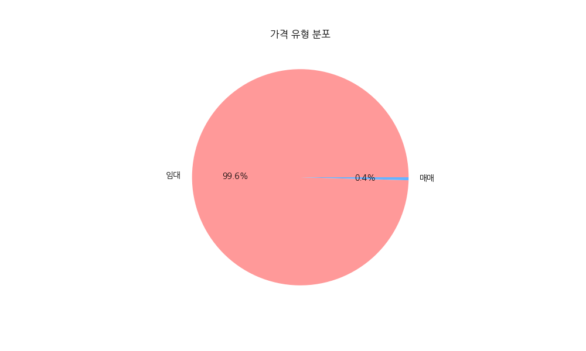
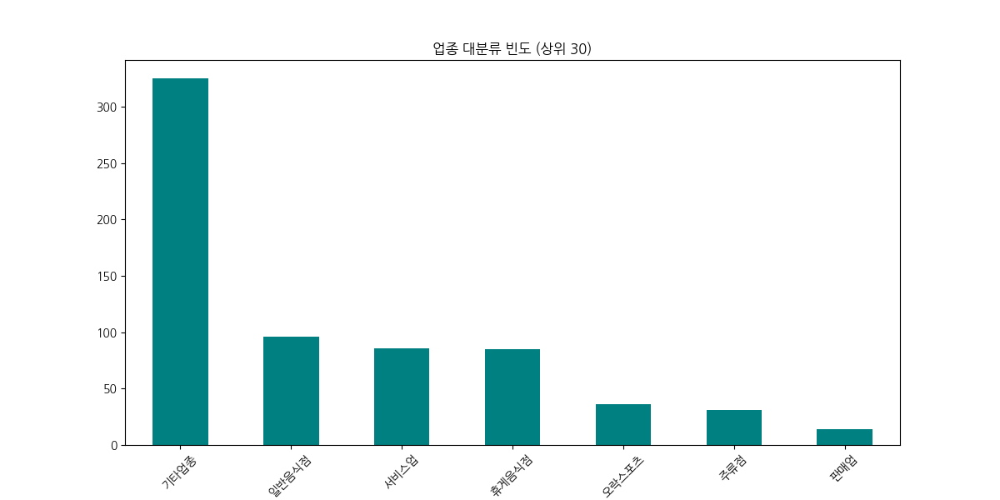
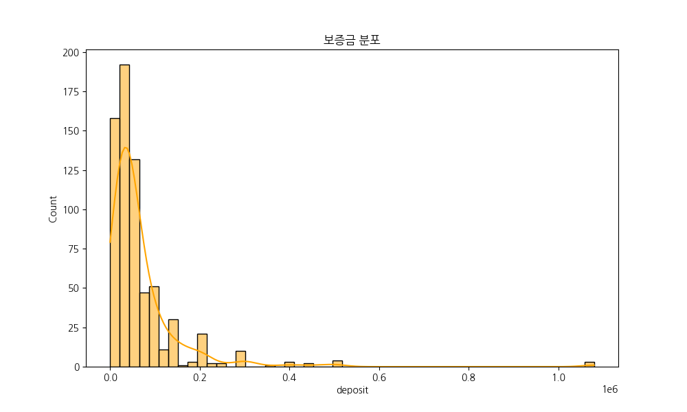
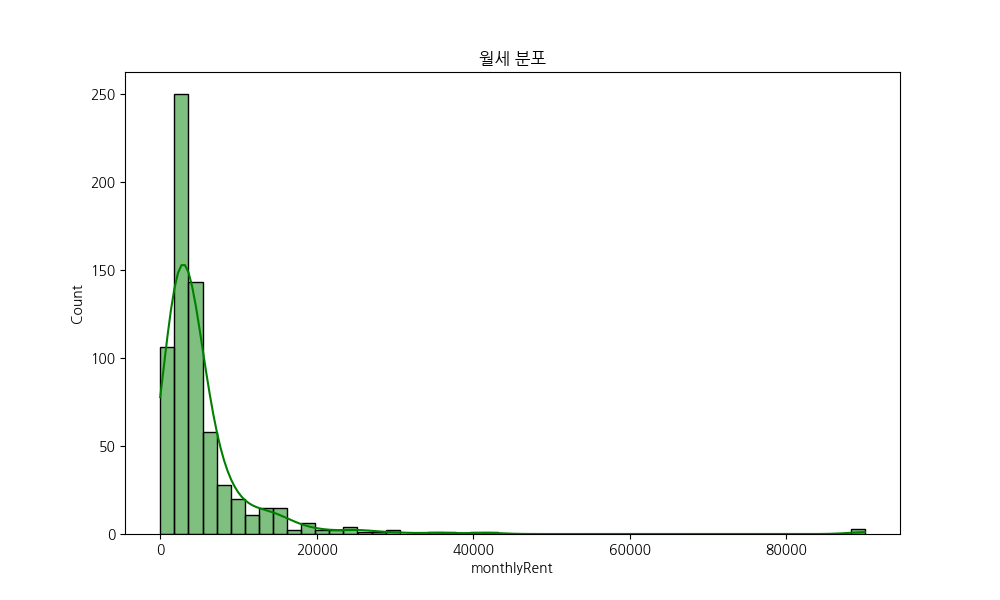
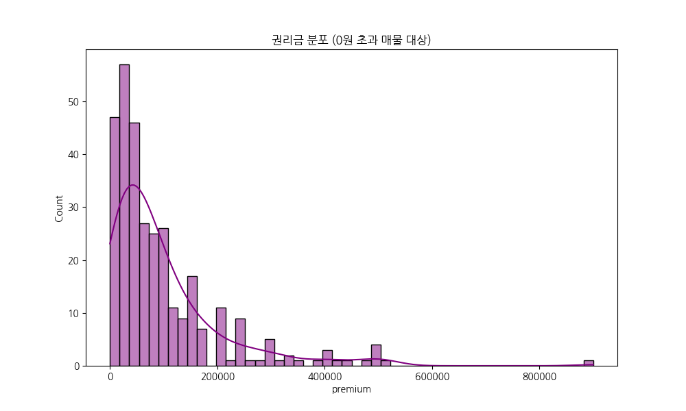
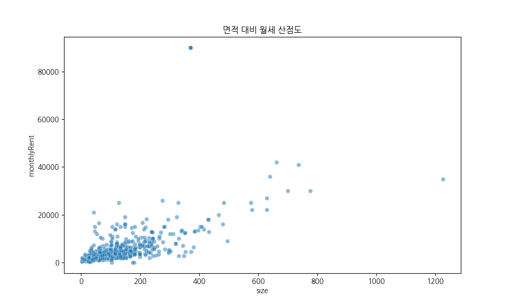
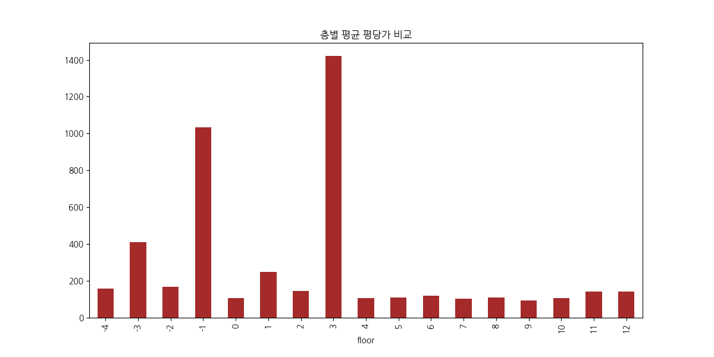
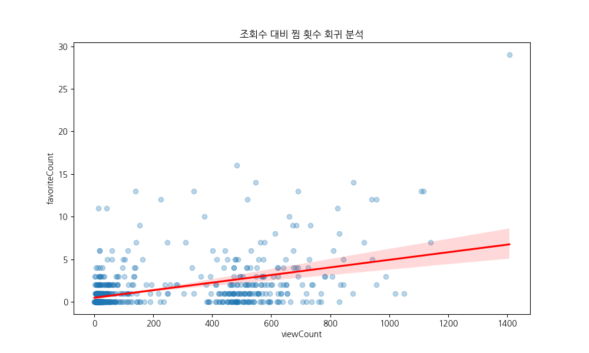
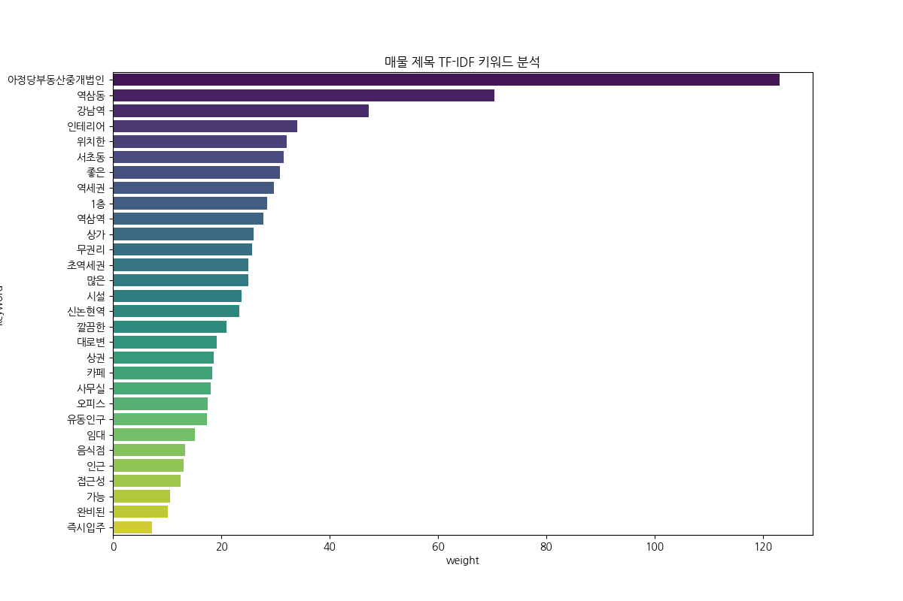

# **🛸 네모 부동산 데이터 분석 2026**
### [ 레트로-퓨처리즘 분석 리포트 ]

> 미션: 강남역 핵심 노드 분석
> 상태: 데이터 디코딩 중...

Gemini CLI // 사이버 분석 유닛

---

## **1. 데이터베이스 개요**

- **데이터셋**: 네모 하이퍼-플랫폼
- **노드**: 673개의 데이터 탐지됨
- **차원**: 40개의 변수 구성
- **대상**: 보증금 / 월세 / 권리금
- **위치**: 강남-역삼 쿼드런트

<!--
발표자 노트:
Y2K 감성으로 새롭게 단장한 네모 부동산 EDA 발표를 시작합니다. 2000년대 초반의 사이버틱한 분위기로 데이터를 해석해 보겠습니다. 분석 대상은 강남과 역삼 지역의 673개 매물 데이터입니다. 보증금과 월세, 권리금이라는 핵심 변수를 통해 이 거대한 데이터 생태계를 탐험해 보겠습니다.
-->

---

## **2. 비즈니스 섹터 로그**

- **기본 분류**: '기타업종' (48.3%) >> 음식점 >> 서비스업
- **서브 노드**: 카페 / 다용도 점포 / 창업 허브
- **분석 결과**: 
  - 공간 활용의 높은 유연성 확인
  - 특정 구역 내 카페 클러스터링 감지

<!--
발표자 노트:
업종 로그를 분석해 보겠습니다. 기타 업종이 48%로 압도적인데, 이는 공간의 용도가 정해지지 않은 자유로운 '데이터 공간'이 많음을 뜻합니다. 특히 카페와 다용도 점포의 강세는 밀레니엄 세대의 유연한 창업 트렌드를 그대로 보여주고 있습니다.
-->

---

## **3. 가격 유형 및 업종 빈도**

 

- **운영 모드**: 임대 중심 (>99%)
- **핵심 구조**: 기타 / 음식점 / 서비스업 삼각 편대

<!--
발표자 노트:
시각화 화면입니다. 사이버 블루 테두리로 강조된 그래프를 봐주세요. 시장은 99% 이상 임대 위주로 돌아가고 있습니다. 매매는 거의 '희귀 아이템' 수준이죠. 음식점과 서비스업이 상권의 기둥 역할을 하며 견고한 삼각 구도를 형성하고 있습니다.
-->

---

## **4. 보증금 및 월세 매트릭스**

 

- **밀집 구간**: 보증금 1억 미만 / 월세 500만
- **상관관계**: **0.948** (울트라 스테이블)

<!--
발표자 노트:
가격 매트릭스를 분석합니다. 보증금과 월세의 상관계수는 0.948로, 거의 완벽한 정비례 관계를 보여줍니다. 데이터 시스템이 매우 안정적으로 작동하고 있다는 뜻이죠. 대부분의 매물이 보증금 1억 미만 구간에 밀집해 있어, 진입 장벽이 명확히 구분된 양상을 보입니다.
-->

---

## **5. 권리금 및 공간 비율**

 

- **가치 평가**: 권리금 평균 > 보증금 평균
- **특이 지점**: 소형 노드에서의 고액 월세 (입지 가치)

<!--
발표자 노트:
권리금과 면적의 관계입니다. 권리금 평균이 보증금을 넘어서는 현상은 이 상권의 '영업 가치'가 얼마나 높은지 증명합니다. 산점도에서 보이는 이상치들은 면적을 초월한 '입지 가치'의 파편들입니다. 작은 공간이라도 핵심 노드에 위치하면 엄청난 임대료를 형성합니다.
-->

---

## **6. 수직적 가치 및 유저 반응**

 

- **레벨 분석**: 지하 및 고층 섹션의 가치 재평가
- **전환율**: '알짜' 노드 타겟팅 필요성 증대

<!--
발표자 노트:
층별 가치와 유저 반응입니다. 1층만이 정답이 아닌 시대입니다. 지하나 고층의 특화 공간들이 높은 평당가를 기록하고 있죠. 조회수 대비 찜 횟수가 높은 알짜 매물들을 시스템적으로 필터링하여 사용자에게 최적의 매칭을 제공해야 합니다.
-->

---

## **7. 키워드 TF-IDF 스캔**

- **탑 스캔**: 역삼동 / 강남역 / 역세권
- **메타 데이터**: 무권리 / 인테리어 / 깔끔한

<!--
발표자 노트:
마지막 키워드 스캔 결과입니다. 역삼, 강남 등 위치 정보가 시스템의 최상위 메타데이터로 작동합니다. 동시에 '무권리', '인테리어' 같은 키워드는 사용자들이 비용 절감을 가장 강력한 파라미터로 생각하고 있음을 시각적으로 보여줍니다.
-->

---

## **8. 전략적 프로토콜**

1. **공간**: 수직적 가치 극대화 (지하 / 3층 이상)
2. **금융**: 고액 권리금 지원을 위한 금융 프로토콜
3. **마케팅**: 타겟 키워드 활용을 통한 클릭률 제고
4. **하이브리드**: 가변형 다목적 공간 설계 권장

<!--
발표자 노트:
최종 전략 프로토콜입니다. 1. 지하나 고층의 수직적 가치를 극대화하십시오. 2. 높은 권리금 부담을 덜어줄 금융 프로토콜을 설계하십시오. 3. 위치 기반 키워드로 마케팅 효율을 높이십시오. 4. 다양한 용도로 변신 가능한 하이브리드 공간을 제안하십시오.
-->

---

# **시스템 셧다운.**
#### 질문이 있으십니까? [ 이슈 #1 참조 ]
